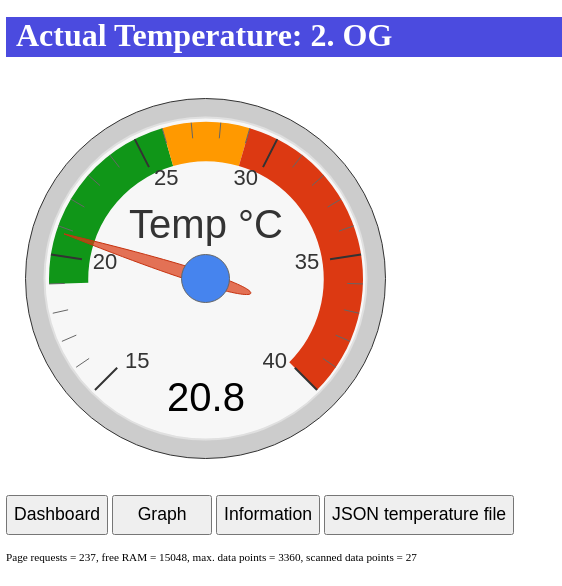
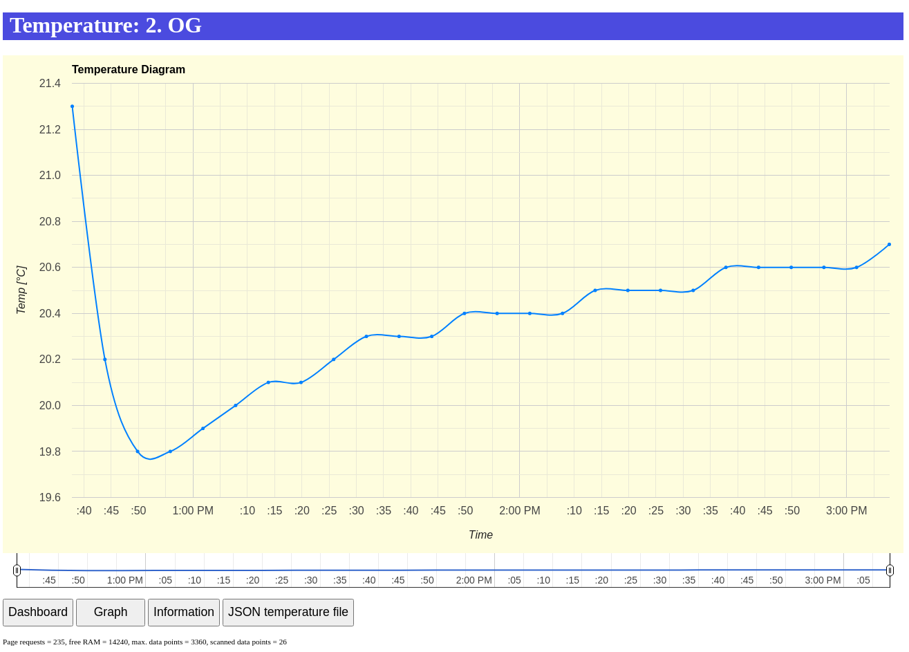
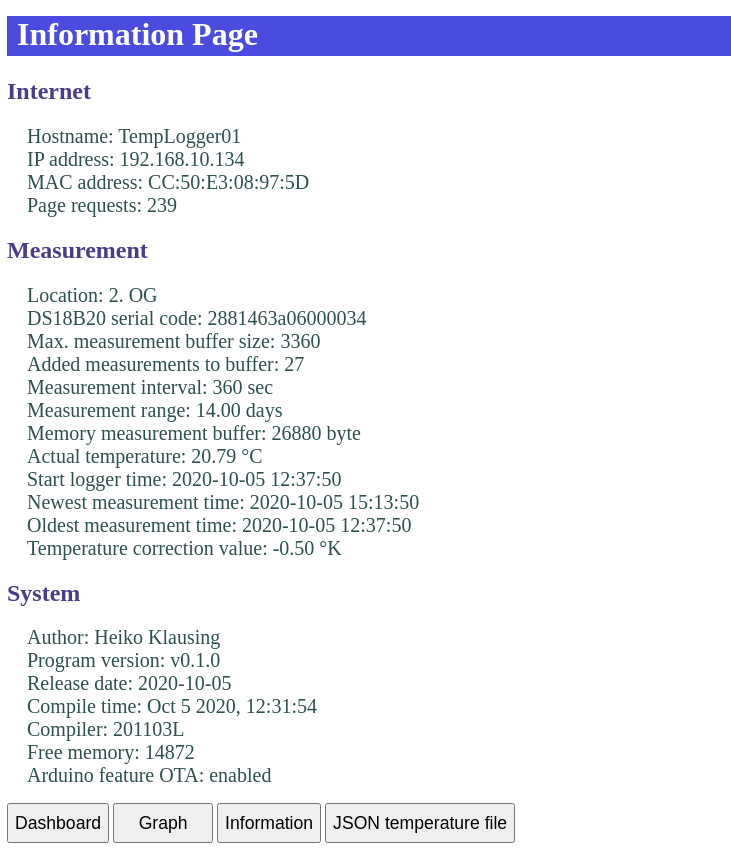
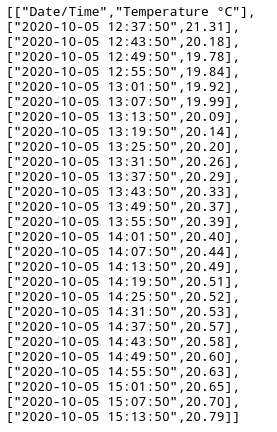

# ESP8266DS18B20

Temperature Logger with ESP8266 and DS18B20

## Features

ESP8266 with temperature sensor DS18B20. The temperature values are presented
on a web server page. The following features are supported:

+ Every 360sec a single averaged temperature value is stored together with a timestamp.
+ The measurement queue stores measurement values for 14 days.
+ Temperature value is visible via a gauge screen.
+ Temperature history is visible as graph and specific investigations possible.
+ A temperature list of last measurements can be load as a JSON list.
+ SSID, password and other information can be inserted via USB modem connection to the EEPROM.
+ EEPROM content can be changed any time with the USB modem connection.
+ Each measurement id signalized by ESP8266 module LED.
+ Each web pages access is signalized by MCUNode LED.
+ Prepared for additional parameters.
+ Temperature value is correctable by an offset.
+ Program updated via OTA possible.
+ Temperature values in °Celsius.


## Hardware

+ NodeMCU v1.0 (ESP-12E Module)
+ DS18B20 connected to Pin D3

```
                                  o 3.3V
                      +------+    |
   +----------+   +---| 4k7Ω |+---o    +--------
   |ESP8266   |   |   +------+    +----|3  Vcc  \
   |       D3 +---o--------------------|2  DQ   |
   |          |                   +----|1  GND  /
   +----------+                   |    +--------
                                  |    DS18B20
                                 ---
```


## Requirements

+ Visual Studio Code
+ Extension: C/C++ Extension Pack
    + ext install ms-vscode.cpptools-extension-pack
+ Extension PlatformIO IDE
    + ext install ...
    + Open PIO Home
        + Open existing project
        + Add Libraries:
            + DallasTemperature by Miles Burton (v3.9.1)
            + Timezone by Jack Christensen (v1.2.4)
+ Monitor speed is 115200


## Installation

+ Download the project in a new directory
+ Change to the directory and start Visual Studio Code `$ code .`
+ Connect the ESP8266 with a USB cable to the PC
+ Compile the project
+ Download the the binary to the ESP8266
+ Wait until the program has started
+ A information text is shown if the ESP8266 EEPROM is not flashed
+ Press the key '**s**', this will set the ESP8266 into a setting mode
+ Now press the key '**?**' to a get a help information
+ Press the key '**l**' to list the current EEPROM content
    + if no content is available some dummy information will be displayed
+ Press on of the listed numbers to change the related content
    + There is no delete function available at the input process
    + If the text needs to be corrected the input has to be started again
+ If the input text is inserted press the key **Enter** to finish the input
+ With the key '**l**' the changes are listed
+ If the input is done press the key '**w**' to write the inserted information to the EEPROM
+ After writing the text to the EERPROM ESP8266 will be restarted

### Update via OTA

* Change to the project directory and update the program as required.
* Open a terminal window.
* `$ platformio run -t upload --upload-port IP-ADDRESS`


## Web Pages

+ http://IP-ADDRESS

    Shows the last measured temperature value. This pages is known as dashboard.

    

+ http://IP-ADDRESS/graph

    Shows the measured temperature graph.
    
    + It is possible to limit the displayed time range by left and right limiter marker.
    + Zoom in is possible by pressing the left mouse button to the start region, moving the mouse to the end region with the pressed mouse button.
    + The Zoom function can be disabled by pressing the right mouse button if the mouse over the graph.

    

+ http://IP-ADDRESS/info

    Lists some details about the temperature logger about the areas Internet, Measurement and System.

    

+ http://IP-ADDRESS/measval.js

    Shows a list with all stored measurement values, the last measurement is at the bottom list.

    

+ http://IP-ADDRESS/restart

    Restarts the temperature logger.
